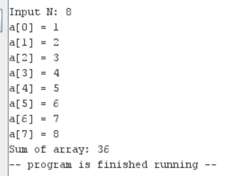

# <center> HW2 - MIPS assembly programming </center>

> 📋 Content:
>
> - [Students](#students)
> - [Main idea](#main-idea)
>>
>> - [Problem 1: Compare two numbers](#problem-1-compare-two-numbers)
>> - [Problem 2: Check if a character is uppercase or lowercase](#problem-2-check-if-a-character-is-uppercase-or-lowercase)
>> - [Problem 3: Input an integer array and print the array](#problem-3-input-an-integer-array-and-print-the-array)
>> - [Problem 4: Find the length of a string](#problem-4-find-the-length-of-a-string)
>> - [Problem 5: Input an array of integers and find the sum of the array](#problem-5-input-an-array-of-integers-and-find-the-sum-of-the-array)
>>
> 🔗 Link source code:
>- [Google Drive](https://drive.google.com/drive/folders/1QRy-D17ifxe_yccCWs-GqgQlyI1IZbL_?usp=sharing)
>
>- [GitHub](https://github.com/HZeroxium/HTMT_HW)

## Students

1. 22127004 - Trình Cao An
2. 22127022 - Võ Hoàng Anh
3. 22127121 - Đào Việt Hoàng
4. 22127135 - Nguyễn Lê Hùng
5. 22127154 - Nguyễn Gia Huy
6. 22127192 - Trần Gia Khiêm
7. 22127210 - Phạm Anh Khôi

## Main idea

### Problem 1: Compare two numbers

- Pseudo code

```c++ =
if (a > b) {
    print("a > b");
} else if (a < b) {
    print("a < b");
} else {
    print("a = b");
}
```

- Output screenshot


### Problem 2: Check if a character is uppercase or lowercase

- Pseudo code

```c++ =
c = readChar("Input a character: ");
if (c >= 'A' && c <= 'Z') {
    print("Uppercase");
} else if (c >= 'a' && c <= 'z') {
    print("Lowercase");
} else {
    print("Invalid");
}
```

- Output screenshot
  


### Problem 3: Input an integer array and print the array

- Pseudo code

```c++ =
n = readInt("Input n: ");
allocate a[n * 4];
int i = 0;
pointer p = a;
while (i < n) {
    *(p + i * 4) = readInt("Input a[" + i + "] = ");
    i++;
}
i = 0;
while (i < n) {
    print("a[" + i + "] = " + *(p + i * 4));
    i++;
}


```

- Output screenshot
  


### Problem 4: Find the length of a string

- Pseudo code

```c++ =
s = readString("Input a string: ");
i = 0;
while (s[i] != '\0') {
    i++;
}
print("Length of the string: %d", i);
```

- Output screenshot
  


### Problem 5: Input an array of integers and find the sum of the array

- Pseudo code

```c++ =
n = readInt("Input n: ");
allocate a[n * 4];
int i = 0;
pointer p = a;
while (i < n) {
    *(p + i * 4) = readInt("Input a[" + i + "] = ");
    i++;
}
i = 0;
int sum = 0;
while (i < n) {
    sum += *(p + i * 4);
    i++;
}
print("Sum of the array: %d", sum);
```

- Output screenshot
  

